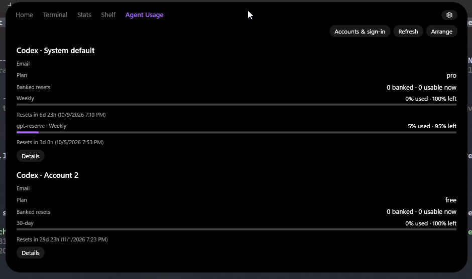
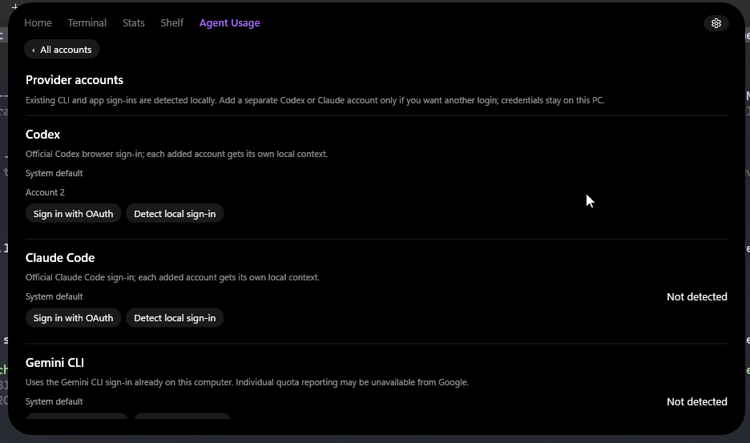
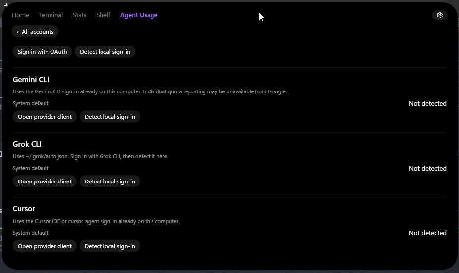

# WNotch-AgentStats

An **Agent Usage** tab for [WNotch](https://github.com/Brick-Bread/WNotch). It keeps the accounts you've signed into on this PC in one place: Codex, Claude Code, Gemini CLI, Grok CLI, and Cursor.

For each account, the tab shows the email and plan when the provider supplies them, usage bars for reported limits, and local reset times. Turn on **Privacy** to mask email addresses behind clickable shaded boxes; click an address to reveal it, then click again to hide it. The setting is saved, but revealed addresses are hidden again when the plugin restarts or Privacy is toggled. Rename an account in **Details**, or press **Arrange** in the overview to reveal Move up/down controls. Codex also shows banked-reset counts and each available reset's expiration when its separate read-only credit response supplies one. The overview shows the first three expirations; **Details** shows the full list. Missing dates stay marked unavailable. A failed refresh leaves the last reading marked stale rather than presenting it as current.

## Screenshots

### Usage overview



### Accounts & sign-in





## Install

In WNotch **Settings → Plugins**, enter `tinywifi/WNotch-AgentStats` and press **Install**, then **Save** to enable it. WNotch downloads the ZIP attached to the latest release. Later, use **Check for updates** in the same settings page.

For a manual install, download the release ZIP and extract its contents directly into `%APPDATA%\Notch\plugins\agentstats.agent-usage\`. `plugin.json` and `AgentUsage.dll` must be in that folder, not a second nested folder. Enable it in WNotch's Plugins settings. To replace a manually installed DLL, quit WNotch first, replace the files, then reopen it.

Requires WNotch v0.8.1 or newer. The plugin ID remains `agentstats.agent-usage` so existing accounts and updates continue to work.

## Accounts and sign-in

Open **Agent Usage → Accounts & sign-in**. Existing local sign-ins are detected automatically; **Detect local sign-in** checks again after you sign into a provider's own client. **Sign in with OAuth** creates a separate local profile for another Codex or Claude Code account, leaving your default login alone. Codex uses the official CLI's browser login and local callback server; the tab also offers **Open link**, **Copy link**, and an optional field for a full localhost callback URL when you authenticate in another browser. Claude Code opens its own sign-in flow.

Gemini, Grok, and Cursor use their installed client sign-ins. The plugin opens the provider client and then detects its local account; it does not claim to provide a separate managed OAuth flow for those providers. Google no longer returns individual Gemini AI Pro/Ultra CLI quotas from the older CLI route, so those limits may be unavailable.

The plugin never asks for passwords. Provider sign-in files remain in the provider's own format on this machine. Saved account metadata and legacy entries use Windows user-scoped DPAPI at `%APPDATA%\Notch\plugin-data\agentstats.agent-usage\accounts.dpapi`; previously saved manual/token entries can be removed but cannot be newly added in the UI. Tokens are sent only to the relevant provider's HTTPS usage endpoint and are not logged. Software running as your Windows user can still read local sign-ins, so only install plugins you trust.

## Build

Install the .NET 10 SDK and WNotch. The project uses the `Notch.Core.dll` next to an installed WNotch by default:

```powershell
dotnet publish AgentUsage.csproj -c Release -o dist/agentstats.agent-usage
dotnet run --project Checks/AgentUsage.Checks.csproj -c Release
```

For another WNotch build, pass `-p:NotchCorePath="C:\path\to\Notch.Core.dll"` to both commands. The checks use synthetic provider responses and temporary local test files; `-- --live-codex` also performs a read-only quota check against the currently signed-in Codex account.

Pushing a `v*` tag runs the release workflow: it builds against WNotch v0.8.1, runs the checks, publishes a plugin folder, and attaches exactly one ZIP to the GitHub release. The ZIP has `plugin.json` at its root for WNotch's GitHub installer.

## License

[MIT](LICENSE).
